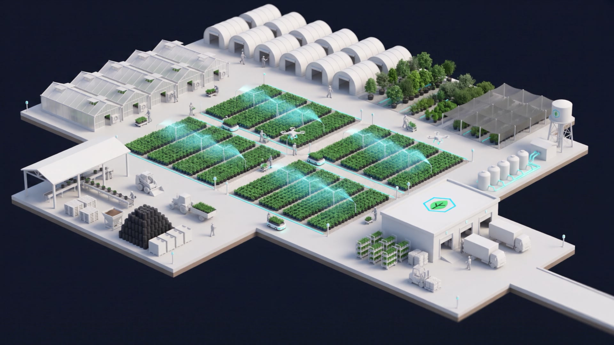

import cover from './cover.jpg';

Body starts here. Plain paragraphs and headings are Markdown. Headings inside a post start at two hashes.

## A section heading

A plain image with no caption is just Markdown:

An image with a caption uses Figure. Import the image at the top of the file first.

<Figure src={cover} alt="Overhead irrigation on a block of containers" caption="What the reader should notice." credit="Photo: Canopy" />

A wide figure breaks out of the reading column on desktop:

<Figure src={cover} alt="A wide shot of the yard" caption="Wide figures are for landscapes and charts." size="wide" />

A YouTube video. Use the id from the URL after v=. The iframe loads only when clicked.

<Video id="dQw4w9WgXcQ" title="Walking a zone with the Canopy controller" caption="Optional caption under the video." />

A short looping clip in place of a GIF. Keep it under ten seconds and three megabytes, muted, MP4. Import it like an image.

{/* import relay from './relay.mp4'; then: <Clip src={relay} alt="Zone 4 valve opening" caption="Eight seconds, muted, loops." /> */}

<Callout label="How to measure it">
Set a saucer under three representative containers before an irrigation run. Divide drainage by the volume applied.
</Callout>

<PullQuote cite="Caleb Saunders">
The schedule is not wrong, exactly. It is disconnected from the plant.
</PullQuote>

Close with what the reader should do next.
